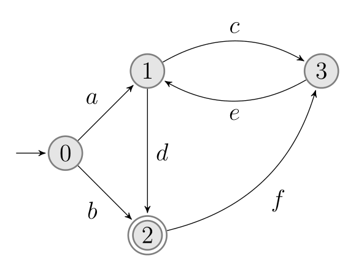

### Simple Automata Implementation

- A simple automata implementation which supports 4 states and the finite alphabet {a, b, c, d, e, f}.
- State Pattern has been adopted for the implementation of the Java Console Application.

- User feeds the application via the command prompt by providing words to be consumed by the automata. If the input is an accepted word according to the automata`s language, user is notified via the message: "Input word is an Accepted Word of the Automata.", else an Unchecked Exception is thrown with the message; "Input word is NOT an Accepted Word of the Automata!"

### States and transitions of the Automaton

  

### Sample Inputs

> adfeced

Input word is an Accepted Word of the Automata.

> adfeced

AutomataException: Input word is NOT an Accepted Word of the Automata!
